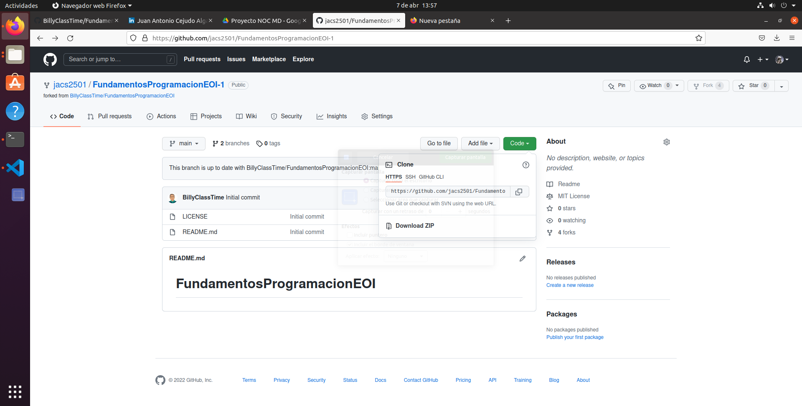

# Objetivos de la mañana de hoy

1 - Instalar un editor de markdown (CONSEGUIDO)

[GUIA BREVE MARKDOWN ](http://fobos.inf.um.es/R/taller5j/30-markdown/guiabreve.pdf)



2 - Explorar GitHub (CONSEGUIDO)


3 - Explorar Git  

1. ​      Descargar e instalar el git (CONSEGUIDO)

​			  https://git-scm.com/download/win

2. Usar el git creando un repositorio local por primera vez **(SOLO LA PRIMERA VEZ)**

   CONFIGURACION INICIAL 
   
   2.1 Crear una carpeta de trabajo

```
c:> cd -- Cambia de carpeta, md -- crea carpeta, rd -- borra carpeta
    cls -- limpiar la ventana de command prompt
    
c:>MD 00-EOI
C:>CD 00-EOI
```

​      2.2 Comprobar que el GIT esta instalado 

```
c:>git
```

​     2.3 Crear un repositorio local

```
c:> git init 
Initialized empty Git repository in C:/00-EOI/.git/
```

​    2.4 Revisar la configuración global al ordenador de GIT (La respuesta es que no tiene configuración global)

```
c:>git config --global -l
fatal: unable to read config file 'C:/Users/WDAGUtilityAccount/.gitconfig': No such file or directory
```

​    2.5 Establecemos el usuario y el correo electrónico

```
c:>git config --global user.name "BillyClassTime"
```

```
c:>git config --global email="billy@billyclasstime.com" 
```
2.6 Comprobar la configuración global previamente establecida

```
c:>git config --global -l
user.name=BillyClassTime
user.email=billy@billyclasstime.com
```

3. Establecer una conexión entre mi repositorio local y el repositorio remoto (GITHUB)

```
IR AL GITHUB -> COPIAR la ruta del repositorio de git
```


Establecemos la conexion

```
git remote add main https://github.com/BillyClassTime/FundamentosProgramacionEOI.git
```


CONFIRMACION DE NUESTRO USUARIO DE GITHUB

PANTALLAZO